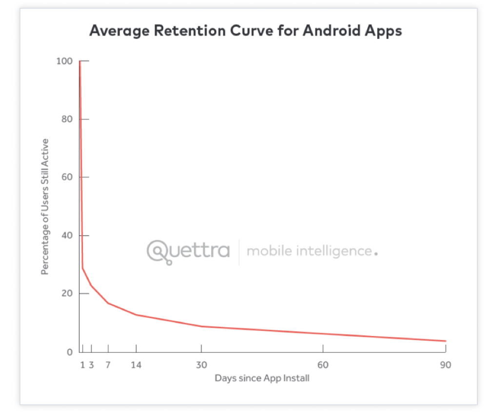
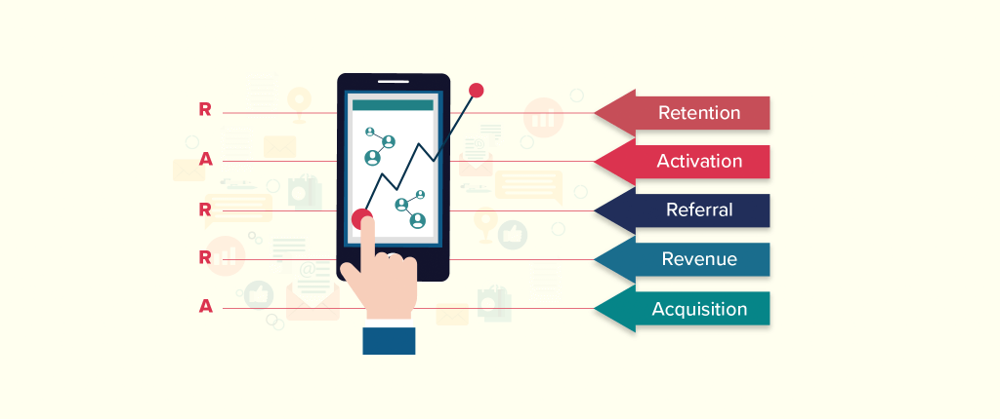
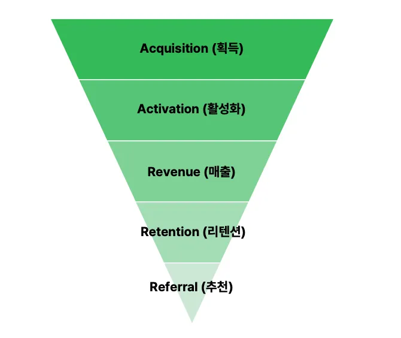

## AARRR에 대해 알아보자.

제품이나 서비스의 사용자 성장 퍼널을 분석하는 프레임워크
<br />이름 그대로 5단계의 앞글자를 따서 부름

### 5단계

> AARRR = Acquisition(획득) → Activation(활성화) → Retention(유지) → Revenue(수익) → Referral(추천)

| 단계            | 의미   | 핵심 질문                                 | 예시 지표                            |
| --------------- | ------ | ----------------------------------------- | ------------------------------------ |
| **Acquisition** | 획득   | 사용자가 어디서 유입되는가?               | 방문자 수, 앱 설치 수, CAC           |
| **Activation**  | 활성화 | 사용자가 서비스의 가치를 처음 경험했는가? | 회원가입 완료율, 첫 핵심 행동 완료율 |
| **Retention**   | 유지   | 사용자가 다시 돌아오는가?                 | D1/D7/D30 Retention, 재방문율        |
| **Revenue**     | 수익   | 사용자가 돈을 지불하는가?                 | 결제 전환율, ARPU, LTV               |
| **Referral**    | 추천   | 사용자가 다른 사용자를 데려오는가?        | 추천율, 초대 수, 바이럴 계수         |

## 예를 들어 제타는?

- Acquisition : 검색, SNS(틱톡), 광고를 통해 사이트에 들어온다.
- Activation : 회원가입 후 첫 대화를 진행한다.
- Retention : 다음 날(주)에 다시 대화한다.
- Revenue : 한 채팅에서 광고를 3번 이상 시청하거나 제타패스를 구매하거나 피스를 추가 구입한다.
- Referral : 친구에게 공유한다.

> 나는 이렇게 생각했는데 GPT는 각 단계가 측정 가능한 이벤트/지표까지 내려가면 좋다고 함

| 단계            | 제타에서의 정의                                                         | 볼 수 있는 지표 예시                                 |
| --------------- | ----------------------------------------------------------------------- | ---------------------------------------------------- |
| **Acquisition** | 검색, 틱톡/SNS, 광고 등을 통해 제타에 유입된다                          | 채널별 유입 수, 설치 수, CAC, 유입→가입 전환율       |
| **Activation**  | 회원가입 후 캐릭터와 첫 대화를 시작하고, 일정 수준 이상 대화를 경험한다 | 가입→첫 대화 전환율, 첫날 대화 수, 첫 세션 길이      |
| **Retention**   | 다음 날/다음 주에도 다시 방문해 대화한다                                | D1, D7, D30 Retention, 주간 재방문율                 |
| **Revenue**     | 광고를 반복 시청하거나 제타패스/피스를 구매한다                         | 광고 시청 사용자 비율, 결제 전환율, ARPU, ARPPU, LTV |
| **Referral**    | 대화 캡처나 플롯을 친구에게 공유해 새로운 사용자를 유입시킨다              | 공유율, 초대당 신규 가입 수, 추천 전환율             |


## AARRR은 제품마다 다르게 정의되어야한다.

### 왜 다르게 정의되어야 할까?

AARRR의 5가지 철자(단계)는 고정되지 않고 각 철자가 의미하는

> '실제 유저의 행동(핵심 이벤트)'와 '측정지표'는
> 제품의 성격, 비즈니스 모델, 유저 타겟에 따라 완전히 달라지기 때문

### 예를 들어

최근 서비스의 형태에 따라 철자의 단계가 바뀌는 경우도 있는데 <br />그 이유는 AARRR기업이 제공되는 서비스에 따라 효과 및 효율이 크게 달랐기 때문.

예시로 제공하는 서비스가 웹이 아닌 앱의 경우로 접근해보겠소.<br />
대부분의 앱서비스는 새로운 사용자 확보보단 앱을 재사용하는 유저 확보가 더 중요함.



안드로이드앱의 평균 리텐션율을 보여주는 그래프.<br />
보다시피 대다수의 앱은 최초 설치 후 3일 이내에 DAU의 77%를 잃는다.<br />
30일이내에는 DAU의 90%가 손실되고 90일이 지나면 그 수치는 95%이상으로 증가되어 앱의 잔존율 데이터는 바닥을 침

그래서 리텐션이 핵심 병목인 앱에서는 RARRA 관점이 더 유용할 수 있음.



유저 획득 비용이 높고 유지율이 낮다면 RARRA가 더 나은 성장 모형, <br />그러나 경쟁이 덜 한 시장에서 새로운 솔루션을 제공하는 사업자라면 AARRR이 더 나은 선택지.

### 오케이 느낌 알았으

## 제품성장: AARRR을 반드시 한 방향으로만 이동하는 선형 퍼널로 이해하면 한계가 있다.

[제품성장 : AARRR은 퍼널이 아니다](https://medium.com/@newgod1973/%EC%A0%9C%ED%92%88%EC%84%B1%EC%9E%A5-aarrr%EC%9D%80-%ED%8D%BC%EB%84%90%EC%9D%B4-%EC%95%84%EB%8B%88%EB%8B%A4-463a87990c51)

제품 성장에 대해 고민한 분들이라면, 누구나 한 번쯤 AARRR 프레임워크를 들어봤을 것
반면, AARRR을 어떤 관점으로 생각하고 사용해야하는지는 정립되지 않은 것 같음.
특히

> 'AARRR? 좋은 개념이지, 근데 당연하잖아?'

정도로 받아들여지는 것 같다잉

이 글은 아래와 같은 생각을 넘기 위해 작성됨

> "AARRR? 그거 그냥 퍼널(깔때기)잖아, (어차피 실제로는 더 쪼개서 볼걸?)"

### AARRR을 검색하면

일반적으로 가장 많이 볼 수 있는 형태는 Funnel(깔때기).
대략 아래 같은 설명

```
1000명의 유저를 획득하고,
↓
600명이 Activation 되어,
↓
400명이 매출(Revenue)을 만들고,
↓
300명이 Retention 되고,
↓
그 중 100명이 추천을 한다.
```



### 그렇지만 전에 위에서 말했듯

> 과연 Activation → Revenue 구조가 맞을까?<br />
> AARRR은 제품마다 다르게 정의되어야한다.

예를 들어 **구글 드라이브**를 생각해 봅시다.<br />구글 드라이브는 Freemium 모델로, 15GB를 무료로 제공하고,<br />용량이 부족한 경우 유료 결제를 통해 용량을 확장할 수 있음

#### 먼저 Activation에 대해서 정의해 봅시다.

만약 유료 결제를 Activation으로 정의하면, Activation을 확인하는 데에 시간이 오래 걸림

즉, 유료결제는 매우 보수적인 Activation의 정의임<br /> 이 행동은 명확히 Business Model과 관련이 있지만,<br /> Activation 관측이 오래 걸리고 결과 지표에 가깝다고 생각함.

따라서 아래처럼 정의하는 게 더 적합하다고 판단했을 것.

```
Activation : 1GB 이상의 파일을 구글 드라이브에 업로드하는 것
Retention : 업로드/다운로드
Revenue : 유료결제 (용량 업그레이드)
```

여기서 Funnel 구조의 한계가 명확히 드러남 <br />Revenue의 발생 시점은 Activation의 정의마다 다를 수밖에 없다!

## 만약 제타라면?

- 지속적인 5턴 이상의 연속 대화를 가치있는 행동 = Activation
- 내일 또 찾아와 채팅을 지속하고? = Retention
- 광고(작은 Revenue)를 시청하고 이에 대해 불편함을 느꼈다면 제타패스 구매(큰 Revenue) = Revenue

### 작은 결론

결국 기업의 수익 모델과 관련된 유효한 활동을 무엇으로 정의하냐에 따라 <br />Retention과 Revenue의 위치는 왔다 갔다 할 수밖에 없습니다.

## 노트를 다 작성한 후 다시 써보는 "예를 들어 제타는?"

Activation 후보
가입 → 캐릭터 선택 → N턴 이상 대화

- 세울 수 있는 가설 : N이 커질수록 Retention이 높아지는가?

Retention 후보
D1 / D7 / D30에 다시 돌아와 캐릭터와 대화

Revenue
광고 시청 / 피스 소비 / 제타패스 결제

- 세울 수 있는 가설 : Retention이 높아질 수록 Revenue도 증가하나? 근데 이건 맞지 않나.

Referral
플롯 · 대화 캡처 공유 -> 신규 유입

## 큰 결론

```
AARRR의 핵심은 사용자를 A→A→R→R→R 순서로 밀어 넣는 것이 아니라,
제품 성장에 중요한 사용자 행동을 정의하고 그 행동들 사이의 관계를 데이터로 검증하는 것이다.
```
